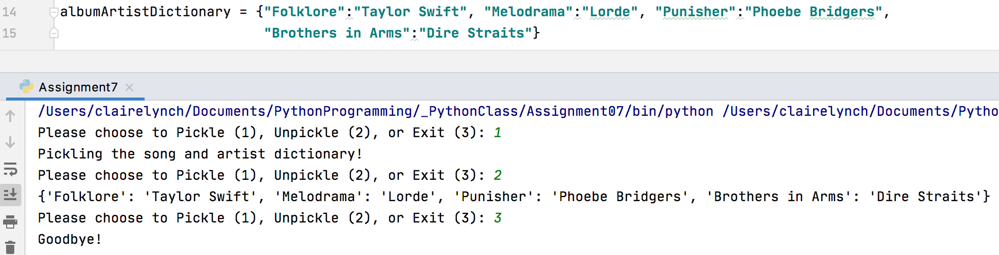
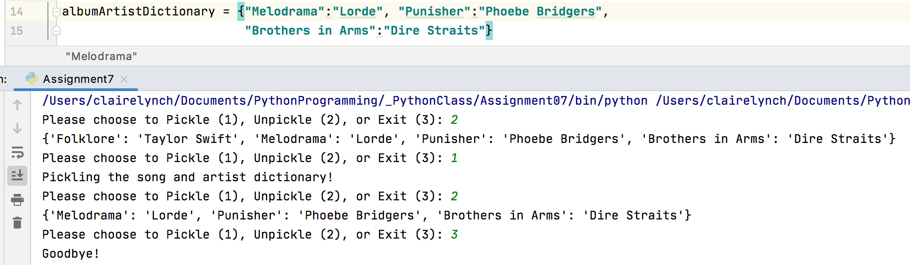

# Pickling and Error Handling
*Claire Lynch, 12.1.2020*

## Introduction
This week, I learned about pickling, a concept I am entirely unfamiliar with. 
I also went further into understanding Exception/Error handling, and how to deal 
with them when they arise. Unlike previous weeks, this week focused on doing my 
own research on Exceptions and Pickling and applying this knowledge to my script to show how they work.

## Pickling and Unpickling
Pickling is a process that converts any sort of Python object, such a list or dictionary,
into byte streams (0’s and 1’s). Files that have been pickled are not able to easily be 
read, and instead have to be unpickled for people to be able to read and understand what 
is in them. Pickling can be useful as it can reduce file size and allow for quicker 
transfer of files and data.

### Useful Links about Pickling:
-This [Tutorials Point](https://www.tutorialspoint.com/python-pickling) link was most useful for me, as I thought it did the best job of explaining pickling and unpickling in simple terms. It had easy-to-follow and understand examples that I was able to use to help me build my own scripts. It also listed some pickling exceptions I might encounter, which was helpful to include in this script.

-I liked this [Geeks for Geeks](https://www.geeksforgeeks.org/understanding-python-pickling-example/) webpage as the pickling example included two different dictionaries, with each dictionary describing characteristics about one person. Despite the slightly more complicated example, I was able to understand what was going on, and applied some elements of this script example they had to my own code. 

-I liked looking at this [Stackoverflow](https://stackoverflow.com/questions/7501947/understanding-pickling-in-python) link as it helped explain pickling and unpickling, but the examples were a little further in-depth than other ones I’ve seen. I found it helpful to look at a variety of examples and make sure I understood the script to ensure I know how pickling works.

```
    def save_data_to_file(file_name, list_of_data):
        # ----Pickling------------------------------#
        try:
            with open(theFile, "wb") as file:
                pickle.dump(albumArtistDictionary, file)
            file.close()
        except:  # Pickle.PicklingError, if the pickle object doesn't support pickling
            print("There is an issue pickling your dictionary!")
            
```
***Figure 1.1: My function that I used to pickle my data, with try-except exception handling.***
```
    def read_data_from_file(file_name):
        # ----Unpickling----------------------------#
        try:
            with open(theFile, "rb") as pickle_off:
                print(pickle.load(pickle_off))
            pickle_off.close()
        except:  # Pickle.UnpicklingError, if the file contains bad or corrupted data
            print("There is an issue unpickling the data!")
```
***Figure 1.2: My function that I used to unpickle my data, with try-except exception handling.***

## Exceptions Handling
Exceptions are some sort of event that occurs when a program is running that disrupts the flow of the program and it’s instructions. An exception is a python object that represents an error.

### Useful Links about Exception Handling:
-I actually got an EOF error at one point due to missing parenthesis, and [this site](https://careerkarma.com/blog/python-syntaxerror-unexpected-eof-while-parsing/) was helpful in determining what an EOF error is and how I could fix it.

-[This](https://stackoverflow.com/questions/33307623/python-exception-safe-pickle-use) was a good source to determine exceptions specifically related to pickles, which helped me figure out what kind of errors to prepare for and how I might catch them.

-I found [Real Python](https://realpython.com/python-exceptions/) to have an expansive list of exceptions and how to handle them, which was very useful.

-I liked [Tutorials Point's page](https://www.tutorialspoint.com/python/python_exceptions.htm) on exceptions, as it provided me with a good understanding of exceptions, and provided a long list of all sorts of exceptions I might encounter with Python. It provided helpful code examples for how to handle an exception, and I applied some of the ideas and concepts from this site to my own scripts.

## Writing My Script
After spending time trying to figure out what the assignment was asking of me and doing research online about exceptions and pickling, I decided I wanted to pickle information about Albums and the Artist(s) who created that album. I added a few albums that I’ve been listening to a lot recently into a dictionary, and then I created a Main where I would be able to pickle, unpickle, and exit the program. If the user decides to Pickle, they would be brought into my save_data_to_file function, which pickles the dictionary to the AppData.dat file. If the user instead decides to unpickle, they will use the read_data_from_file function, which reads the data that currently exists in the AppData.dat file. To check and see if this was working properly, I ran the program once with all the albums in the dictionary, pickled it, unpickled it, and exited the program. I then removed on of the artist/album combos, and re-ran the program, but instead started by unpickling the file. The unpickled file still contained all four albums in it, but once I pickled the data again and unpickled it, it then only contained the three albums.


***Figure 2.1: My script running, showing all four albums ending up in the unpickled data.***


***Figure 2.2: My script running, showing first the four albums in the unpickled data, before pickling once again and ending up with three albums.***

## Summary
At first, I found this assignment to be difficult because I didn’t quite understand what was being asked of me. After doing some research about Exceptions and Pickling, I felt better equipped to actually write some code that shows how these concepts work, and how to create a webpage on GitHub where I uploaded this information.
```
# ------------------------------------------------- #
# Title: Lab7-1
# Description: An example of pickling/unpickling a
# dictionary of songs and artists, with try/exception
# error handling.
# ChangeLog: (Who, When, What)
# CLynch,12.1.2020,Created Script
# ------------------------------------------------- #
import pickle  # This imports code from another code file!

# Data -------------------------------------------- #
# Declare variables and constants
theFile = 'AppData.dat'
albumArtistDictionary = {"Folklore":"Taylor Swift", "Melodrama":"Lorde", "Punisher":"Phoebe Bridgers",
                         "Brothers in Arms":"Dire Straits"}

# Processing -------------------------------------- #
class Processor:
    def save_data_to_file(file_name, list_of_data):
        # ----Pickling------------------------------#
        try:
            with open(theFile, "wb") as file:
                pickle.dump(albumArtistDictionary, file)
            file.close()
        except:  # Pickle.PicklingError, if the pickle object doesn't support pickling
            print("There is an issue pickling your dictionary!")

    def read_data_from_file(file_name):
        # ----Unpickling----------------------------#
        try:
            with open(theFile, "rb") as pickle_off:
                print(pickle.load(pickle_off))
            pickle_off.close()
        except:  # Pickle.UnpicklingError, if the file contains bad or corrupted data
            print("There is an issue unpickling the data!")


# Main -------------------------------------------- #
while(True):

    strChoice = str(input("Please choose to Pickle (1), Unpickle (2), or Exit (3): "))
    if strChoice.strip() == '1': #input data
        Processor.save_data_to_file(theFile, albumArtistDictionary)
        print("Pickling the song and artist dictionary!")

    elif strChoice.strip() == '2': #Pickle
        Processor.read_data_from_file(theFile)

    elif strChoice.strip() == '3': #Unpickle
        print("Goodbye!")
        break
```
***Figure 3.1: My whole script, with both pickling and unpickling, and exception handling. ***


